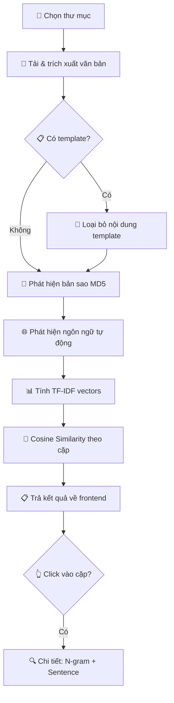

# 📝 SoText — Logic & Algorithms Documentation

> **SoText** là ứng dụng desktop phát hiện tương đồng văn bản, xây dựng bằng **Rust** (backend) + **HTML/JS** (frontend) trên nền tảng **Tauri 2**. Tài liệu này mô tả chi tiết logic xử lý và các thuật toán mà ứng dụng sử dụng.

---

## 📂 Kiến trúc tổng quan

```
src-tauri/src/
├── lib.rs          → Khởi tạo Tauri, đăng ký commands
├── commands.rs     → Các lệnh Tauri (bridge giữa frontend ↔ backend)
├── analysis.rs     → Module phân tích chính: file I/O, MD5, N-gram
├── sentence.rs     → So sánh cấp câu: Jaccard, Levenshtein
├── tfidf.rs        → TF-IDF + Cosine Similarity, auto ngôn ngữ
└── export.rs       → Xuất báo cáo: Excel, HTML, PDF, DOCX

src/
├── index.html      → Giao diện chính
├── main.js         → Logic frontend, gọi invoke() tới Rust
└── i18n.js         → Đa ngôn ngữ (EN / VI)
```

---

## 🔄 Luồng xử lý chính (Pipeline)

Khi người dùng nhấn **"Scan"**, luồng xử lý diễn ra theo thứ tự:



---

## 1. 📄 Trích xuất văn bản (Text Extraction)

**File:** `analysis.rs` — hàm `extract_text()`

Hỗ trợ 5 định dạng:

| Định dạng | Phương pháp | Crate |
|-----------|-------------|-------|
| `.txt` | Đọc trực tiếp UTF-8 | `std::fs` |
| `.docx` | Tách nội dung XML từ file OOXML | `dotext` |
| `.pdf` | Parse content stream: `Tj`, `TJ`, `'`, `"`, `ET` operators | `lopdf` |
| `.html/.htm` | Parse DOM, thu thập text từ tất cả node | `scraper` |

### Chi tiết PDF Extraction

PDF không lưu text đơn giản — text nằm trong các **content stream operators**:

```
Tj  → Hiển thị chuỗi text đơn
TJ  → Hiển thị mảng text (xen kẽ chuỗi + vị trí kerning)
'   → Xuống dòng mới + hiển thị text
"   → Đặt spacing + xuống dòng + hiển thị text
ET  → Kết thúc khối text (thêm dấu cách phân tách)
```

Encoding hỗ trợ: **UTF-16 BE** (BOM `0xFEFF`) và **Latin-1/PDFDocEncoding**.

---

## 2. 🔐 Phát hiện bản sao chính xác (MD5 Duplicate Detection)

**File:** `analysis.rs` — hàm `find_exact_duplicates()`

### Thuật toán:

1. **Chuẩn hóa** nội dung:
   - Chuyển lowercase
   - Thay tất cả ký tự không phải chữ/số thành dấu cách
   - Gộp nhiều dấu cách thành 1
   
2. **Băm MD5** nội dung đã chuẩn hóa

3. **Nhóm** các file có cùng hash → đó là bản sao

```
"Hello, World!" → "hello world" → MD5: fc5e...
"hello  world"  → "hello world" → MD5: fc5e... ← Cùng nhóm!
```

> **Mục đích:** Phát hiện nhanh các file hoàn toàn giống nhau dù khác formatting (chấm câu, khoảng trắng, viết hoa/thường).

---

## 3. 🌐 Phát hiện ngôn ngữ tự động (Language Detection)

**File:** `tfidf.rs` — hàm `detect_language()`  
**Crate:** `whatlang`

### Thuật toán:

1. Lấy **500 ký tự đầu** từ mỗi tài liệu
2. Ghép tất cả thành 1 chuỗi mẫu
3. Dùng `whatlang::detect()` — thuật toán dựa trên **trigram frequency profiles**
4. Mặc định: `English` nếu không nhận diện được

### Hỗ trợ:

| Tính năng | Ngôn ngữ |
|-----------|----------|
| **Stemming** (18 ngôn ngữ) | EN, FR, DE, ES, PT, IT, NL, SV, NO, DA, FI, HU, RO, RU, TR, AR, TA, EL |
| **Stop words** (28 ngôn ngữ) | Tất cả trên + VI, ZH, JA, KO, TH, ID, HI, PL, UK, CS, HE |
| **Không stemming** | VI, ZH, JA, KO, TH... (token giữ nguyên) |

---

## 4. 📊 TF-IDF (Term Frequency — Inverse Document Frequency)

**File:** `tfidf.rs` — hàm `compute_tfidf_vectors()`

### 4.1 Tokenization

```
"Hello, World!" → ["hello", "world"]
```
- Tách theo ký tự không phải chữ/số (giữ lại `'`)
- Chuyển lowercase

### 4.2 Stop Words Removal

Loại bỏ các từ phổ biến không mang ý nghĩa phân biệt (ví dụ: "the", "is", "và", "của"...) dựa theo ngôn ngữ đã detect.

### 4.3 Stemming (Snowball Algorithm)

Đưa từ về dạng gốc:

```
"running" → "run"
"restaurants" → "restaur"
```

**Crate:** `rust-stemmers` — triển khai thuật toán Snowball Stemmer.

### 4.4 Tạo terms: Unigrams + Bigrams

```
Tokens: ["cat", "sat", "mat"]
Unigrams (bỏ stop words): ["cat", "sat", "mat"]
Bigrams: ["cat sat", "sat mat"]
```

> **Bigrams** giúp bắt bối cảnh cặp từ liên tiếp, tăng độ chính xác so sánh.

### 4.5 Tính TF-IDF

Cho mỗi term `t` trong tài liệu `d`:

```
TF(t, d) = (số lần t xuất hiện trong d) / (tổng số terms trong d)

IDF(t) = ln(N / DF(t)) + 1
    N  = tổng số tài liệu
    DF = số tài liệu chứa term t

TF-IDF(t, d) = TF(t, d) × IDF(t)
```

### 4.6 Giới hạn từ vựng

Chỉ giữ **top 10,000 terms** có document frequency cao nhất → tối ưu bộ nhớ + tốc độ.

### 4.7 L2 Normalization

Chuẩn hóa vector để cosine similarity = dot product:

```
v_normalized = v / ||v||₂
```

---

## 5. 📐 Cosine Similarity

**File:** `tfidf.rs` — hàm `cosine_similarity()`

So sánh 2 vector TF-IDF đã chuẩn hóa:

```
cosine(A, B) = A · B = Σ(Aᵢ × Bᵢ)
```

> Vì đã L2-normalize nên cosine = dot product.

**Dùng sparse vector** (HashMap) — chỉ lưu và tính trên các dimensions khác 0. Tối ưu khi vector rất thưa.

### Pairwise Comparison

So sánh tất cả các cặp `(i, j)` với `i < j`:
- Chỉ giữ các cặp có `score ≥ threshold`
- Sắp xếp giảm dần theo score
- Score được chuyển thành phần trăm: `score × 100`

---

## 6. 🔍 N-gram Matching (Chi tiết)

**File:** `analysis.rs` — các hàm `get_ngrams()`, `find_common_phrases()`, `get_highlight_ranges()`

### Thuật toán:

1. **Tạo N-gram:** Trượt cửa sổ kích thước `n` (mặc định = 5) qua danh sách từ:
   ```
   "the quick brown fox jumps" (n=3)
   → {"the quick brown", "quick brown fox", "brown fox jumps"}
   ```

2. **Tìm giao:** N-gram chung = giao của 2 tập N-gram

3. **Xác định vị trí highlight:** Tìm tất cả vị trí (byte range) trong văn bản gốc mà match

4. **Merge overlapping ranges:** Nếu 2 highlight chồng nhau → gộp thành 1:
   ```
   [0,10] + [8,15] → [0,15]
   ```

> **Mục đích:** Phát hiện các cụm từ được sao chép nguyên văn.

---

## 7. 📝 So sánh cấp câu (Sentence-Level Analysis)

**File:** `sentence.rs`

### 7.1 Tách câu (`split_sentences()`)

- Dấu kết thúc: `.` `!` `?`
- Hoặc xuống dòng đôi `\n\n` (ngắt đoạn)
- Chỉ giữ câu có **≥ 3 từ** (bỏ qua câu quá ngắn)
- Trả về: `(nội dung câu, byte_start, byte_end)` để highlight chính xác

### 7.2 Jaccard Similarity

So sánh tập từ (word-set) giữa 2 câu:

```
J(A, B) = |A ∩ B| / |A ∪ B|
```

**Ví dụ:**
```
A = "the cat is sleeping on the mat" → {the, cat, is, sleeping, on, mat}
B = "on the mat the cat is sleeping" → {the, cat, is, sleeping, on, mat}
J(A, B) = 6/6 = 1.0  ← Phát hiện đảo từ!
```

> **Mục đích:** Phát hiện câu bị **đảo thứ tự từ** (paraphrasing đơn giản).

### 7.3 Levenshtein Similarity

Sử dụng khoảng cách chỉnh sửa Levenshtein (crate `strsim`):

```
lev_sim(A, B) = 1 - (edit_distance(A, B) / max(len(A), len(B)))
```

**Ví dụ:**
```
A = "smoking should be completely banned"
B = "smoking should be completly banned"   ← 1 lỗi chính tả
edit_distance = 1, max_len = 35
lev_sim = 1 - 1/35 ≈ 0.97  ← Rất giống!
```

> **Mục đích:** Phát hiện nội dung bị **thay đổi nhỏ** (lỗi chính tả cố ý, thay 1-2 từ).

### 7.4 Kết hợp

Một cặp câu bị đánh dấu "suspicious" nếu **bất kỳ** metric nào vượt threshold (mặc định 0.7):

```
suspicious = (jaccard ≥ 0.7) OR (levenshtein ≥ 0.7)
```

Dùng **OR** vì mỗi metric bắt loại paraphrasing khác nhau:
- **Jaccard tốt cho:** đảo vị trí từ, thêm/bớt vài từ
- **Levenshtein tốt cho:** thay đổi ký tự nhỏ, lỗi chính tả

---

## 8. 🧹 Loại trừ Template (Template Exclusion)

**File:** `sentence.rs` — hàm `strip_template()`

### Thuật toán:

1. Tách cả **text** và **template** thành câu
2. Với mỗi câu trong text, tính Jaccard similarity với tất cả câu template
3. Nếu Jaccard > **0.9** → câu đó là từ template, loại bỏ
4. Ghép phần còn lại

> **Mục đích:** Khi giáo viên cho đề bài chung, các bài làm sẽ chứa câu hỏi giống nhau → loại bỏ phần template trước khi so sánh để tránh false positive.

---

## 9. 📊 Tổng quan 4 tầng phát hiện

| Tầng | Thuật toán | Phát hiện gì | Ví dụ |
|------|-----------|-------------|-------|
| **Level 1** | MD5 Hash | Bản sao 100% giống nhau | Copy-paste nguyên văn |
| **Level 2** | TF-IDF + Cosine | Nội dung tương tự về chủ đề | Viết lại cùng ý → cosine cao |
| **Level 3** | N-gram Matching | Cụm từ sao chép nguyên văn | Copy 1 đoạn dài, giữ nguyên |
| **Level 4** | Jaccard + Levenshtein | Paraphrase / đảo từ / sửa lỗi chính tả | "The cat sat" → "The cat was sitting" |

---

## 10. 📤 Xuất báo cáo (Export)

**File:** `export.rs`

### Các định dạng hỗ trợ:

| Định dạng | Crate | Tính năng highlight |
|-----------|-------|-------------------|
| **Excel (.xlsx)** | `rust_xlsxwriter` | Rich text: vàng (exact) + cam (paraphrased) |
| **HTML** | Tự build | CSS spans với màu nền |
| **PDF** | `genpdf` | Styled text với font hệ thống (Arial) |
| **DOCX** | `docx-rs` | Run-level formatting |

### Hệ thống màu highlight:

| Loại | Màu | Ý nghĩa |
|------|-----|---------|
| 🟡 **Exact Match** | `#FECA57` (vàng) | N-gram match — sao chép nguyên văn |
| 🟠 **Paraphrased** | `#FF9F43` (cam) | Jaccard/Levenshtein match — paraphrase |

### Cấu trúc báo cáo:

1. **Sheet/Section "Summary"** — Bảng tổng hợp: File A, File B, Cosine Score
2. **Sheet/Section "Details"** — Nội dung chi tiết từng cặp với text được highlight

### Color-coding cho Score:

| Score | Màu nền | Mức độ |
|-------|---------|--------|
| ≥ 80% | 🔴 `#FFC7CE` (đỏ nhạt) | Cao — rất đáng ngờ |
| ≥ 60% | 🟡 `#FFEB9C` (vàng nhạt) | Trung bình — cần kiểm tra |
| < 60% | ⚪ Không màu | Thấp — có thể bình thường |

---

## 11. 🛠️ Công nghệ & Dependencies

| Crate | Phiên bản | Vai trò |
|-------|-----------|---------|
| `tauri` | 2.x | Framework desktop app |
| `md-5` | 0.10 | Băm MD5 |
| `rust-stemmers` | 1.2 | Snowball stemming |
| `whatlang` | 0.16 | Detect ngôn ngữ |
| `stop-words` | 0.8 | Stop words 28 ngôn ngữ |
| `strsim` | 0.11 | Levenshtein distance |
| `dotext` | 0.1 | Đọc DOCX |
| `lopdf` | 0.34 | Parse PDF |
| `scraper` | 0.22 | Parse HTML |
| `rust_xlsxwriter` | 0.79 | Ghi Excel |
| `genpdf` | 0.2 | Tạo PDF |
| `docx-rs` | 0.4 | Tạo DOCX |

---

## 12. ⚡ Tối ưu hiệu năng

- **Sparse vectors** — Chỉ lưu các chiều khác 0 trong HashMap, tiết kiệm bộ nhớ cho vector thưa
- **Vocabulary cap 10,000** — Giới hạn từ vựng, tránh OOM khi corpus lớn
- **L2 pre-normalization** — Cosine similarity = dot product đơn giản, không cần tính norm mỗi lần
- **Merge overlapping ranges** — Tránh highlight chồng chéo, O(n log n)
- **PDF: lopdf thay vì pdf-extract** — Tránh crash/panic khi gặp PDF bị lỗi

---

*Tài liệu này được tạo tự động dựa trên source code của SoText v1.3.0.*
